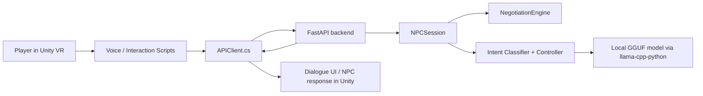

# AI-Enabled Storytelling VR

<div align="center">

An immersive Unity VR prototype that connects a historical spice-market bargaining experience to a local AI-powered NPC dialogue backend.

[](https://unity.com/)
[](https://www.python.org/)
[](https://fastapi.tiangolo.com/)
[](https://github.com/ggerganov/llama.cpp)
[](https://developers.meta.com/horizon/documentation/unity/)
[](https://www.khronos.org/openxr/)

</div>

## Overview

This project combines two main parts:

1. A `Unity` VR application in [`unity/StorytellingVR`](/G:/Users/chitr/Desktop/Capstone/AI-Enabled-Storytelling-VR/unity/StorytellingVR) for the immersive scene, interaction logic, and voice-triggered NPC conversations.
2. A `Python + FastAPI` backend in [`backend`](/G:/Users/chitr/Desktop/Capstone/AI-Enabled-Storytelling-VR/backend) that runs the bargaining engine, dialogue control, session management, and local GGUF model inference through `llama-cpp-python`.

The current experience is centered around a spice-market negotiation loop where the player interacts with an NPC buyer, negotiates pricing and quantity, and receives dynamic responses based on intent, tone, and bargaining state.

## Tech Stack

| Area | Tools |
| --- | --- |
| Game / XR | Unity 6 (`6000.3.10f1`), Universal Render Pipeline, OpenXR, XR Interaction Toolkit, Meta XR SDK |
| Backend API | Python, FastAPI, Uvicorn, Pydantic |
| AI / Dialogue | `llama-cpp-python`, GGUF local model, rule-based negotiation engine, intent classification |
| Voice | Meta Voice / Wit integration in Unity |
| Editor Tooling | Visual Studio Game Development workload, Rider / Visual Studio Unity packages |

## Repository Layout

```text
AI-Enabled-Storytelling-VR/
|-- backend/
|   |-- api.py                      # FastAPI server used by Unity
|   |-- test_interface.py           # Terminal-only chat/system smoke test
|   `-- npc_engine/
|       |-- interface.py            # Session wrapper
|       |-- core/                   # Controller and shared models
|       |-- engine/                 # Bargaining, pricing, memory, buyer logic
|       |-- llm/                    # Intent classifier and local LLM hooks
|       |-- dialogue/               # Dialogue composition layer
|       `-- models/model.gguf       # Local GGUF model (not committed)
|-- unity/
|   `-- StorytellingVR/
|       |-- Assets/_Project/Scripts/
|       |-- Assets/_Project/Scenes/
|       |-- Packages/manifest.json
|       `-- ProjectSettings/
|-- docs/
|-- testing/
`-- requirements.txt               # Root helper file forwarding to backend requirements
```

## Architecture



## What Is Already Implemented

- Session-based NPC conversations exposed through `POST /start` and `POST /step`.
- Bargaining logic for price, quantity, bundles, rejection, acceptance, hostility, and out-of-world inputs.
- A local model path at [`backend/npc_engine/models/model.gguf`](/G:/Users/chitr/Desktop/Capstone/AI-Enabled-Storytelling-VR/backend/npc_engine/models/model.gguf).
- Unity-side scripts for:
  - API communication
  - raycast-based NPC interaction
  - voice transcription forwarding
- Unity package setup for Meta XR, OpenXR, URP, Input System, Cinemachine, and XR Interaction Toolkit.

## Prerequisites

Before setup, make sure a new machine has:

- `Python 3.11` or newer
- `pip`
- `Unity 6.3.10f1` to match [`ProjectVersion.txt`](/G:/Users/chitr/Desktop/Capstone/AI-Enabled-Storytelling-VR/unity/StorytellingVR/ProjectSettings/ProjectVersion.txt)
- `Visual Studio 2022` with the `Game development with Unity` workload, or JetBrains Rider with Unity support
- A machine capable of loading a local GGUF model
- Optional for voice flow: a valid Meta Voice / Wit configuration in Unity

## Python Setup

From the repository root:

```powershell
python -m venv .venv
.\.venv\Scripts\Activate.ps1
python -m pip install --upgrade pip
pip install -r requirements.txt
```

### Important Model Step

The backend expects a local model at:

[`backend/npc_engine/models/model.gguf`](/G:/Users/chitr/Desktop/Capstone/AI-Enabled-Storytelling-VR/backend/npc_engine/models/model.gguf)

That file is ignored by Git, so a fresh clone will not contain it. A new contributor must place a compatible GGUF model there manually before running the backend.

Notes:

- The current local file in this workspace is roughly `4.9 GB`, so plan for disk space.
- `llama-cpp-python` may require local C/C++ build tooling on some Windows setups if a prebuilt wheel is unavailable.

## Run the Backend Only

This is the fastest path for anyone who only wants to validate the AI chat / bargaining system.

### Option 1: Run the terminal chat loop

```powershell
cd backend
python -m npc_engine.main
```

This launches a command-line conversation using `NPCSession` directly, without Unity.

### Option 2: Run the FastAPI server

```powershell
cd backend
uvicorn api:app --host 127.0.0.1 --port 8000 --reload
```

When it starts successfully, open:

[http://127.0.0.1:8000](http://127.0.0.1:8000)

You should see a simple health response.

### Optional API smoke test

Start a session:

```powershell
Invoke-RestMethod -Method Post -Uri "http://127.0.0.1:8000/start"
```

Send a negotiation turn:

```powershell
$body = @{
    session_id = "<paste-session-id>"
    player_input = "I can sell it for 120"
} | ConvertTo-Json

Invoke-RestMethod -Method Post -Uri "http://127.0.0.1:8000/step" -ContentType "application/json" -Body $body
```

## Run the Full Project

### 1. Start the backend first

Unity expects the backend API at:

`http://127.0.0.1:8000`

So keep this running in a terminal:

```powershell
cd backend
uvicorn api:app --host 127.0.0.1 --port 8000 --reload
```

### 2. Open the Unity project

Open:

[`unity/StorytellingVR`](/G:/Users/chitr/Desktop/Capstone/AI-Enabled-Storytelling-VR/unity/StorytellingVR)

Recommended scene entry points:

- [`Assets/_Project/Scenes/SampleScene.unity`](/G:/Users/chitr/Desktop/Capstone/AI-Enabled-Storytelling-VR/unity/StorytellingVR/Assets/_Project/Scenes/SampleScene.unity)
- [`Assets/_Project/Scenes/MainScene1.unity`](/G:/Users/chitr/Desktop/Capstone/AI-Enabled-Storytelling-VR/unity/StorytellingVR/Assets/_Project/Scenes/MainScene1.unity)

The current build settings point to `SampleScene` by default.

### 3. Check the Unity bindings

Make sure the active scene has the correct references assigned for:

- `APIClient`
- `NPCInteractor` or `NPCInteractionTest`
- `VoiceToNPC` if voice is being used
- Any `TMP_Text` field used to display dialogue

### 4. Press Play

Expected flow:

1. `APIClient` starts a backend session on launch.
2. The player looks at / approaches the NPC.
3. Interaction or voice input is forwarded to the FastAPI backend.
4. The backend returns the next bargaining response.
5. Unity updates the on-screen dialogue text.

## Voice / Wit Setup

The project includes Meta Voice integration, but a new setup should verify voice configuration inside Unity before expecting microphone-driven interaction to work.

Checklist:

- Confirm the scene has an `AppVoiceExperience` object.
- Confirm `VoiceToNPC` references both the voice component and `APIClient`.
- Confirm the correct microphone is available.
- Replace any environment-specific or team-specific voice credentials with your own valid configuration.

## Known Integration Caveats

These are worth checking during onboarding:

- The FastAPI backend currently returns response fields such as `npc_text`, `action`, `price`, `quantity`, and `done`.
- The current Unity [`APIClient.cs`](/G:/Users/chitr/Desktop/Capstone/AI-Enabled-Storytelling-VR/unity/StorytellingVR/Assets/_Project/Scripts/APIClient.cs) is deserializing `response.dialogue`.
- If dialogue text is not appearing in Unity even though the backend is running, verify the response model and JSON field mapping first.
- The GGUF model file is not versioned in Git, so backend setup is incomplete until a compatible model is supplied.

## Troubleshooting

### Backend does not start

- Verify the virtual environment is activated.
- Verify `pip install -r requirements.txt` completed successfully.
- Verify the GGUF model exists at [`backend/npc_engine/models/model.gguf`](/G:/Users/chitr/Desktop/Capstone/AI-Enabled-Storytelling-VR/backend/npc_engine/models/model.gguf).

### `llama-cpp-python` install fails on Windows

- Update `pip`, `setuptools`, and `wheel`.
- Ensure C++ build tools are installed.
- Retry inside a clean virtual environment.

### Unity opens with package or XR issues

- Confirm you are using Unity `6000.3.10f1`.
- Let Unity re-resolve packages from [`Packages/manifest.json`](/G:/Users/chitr/Desktop/Capstone/AI-Enabled-Storytelling-VR/unity/StorytellingVR/Packages/manifest.json).
- Reimport packages if Meta XR or OpenXR tooling looks incomplete.

### Voice input does not reach the NPC

- Check microphone permissions.
- Check `VoiceToNPC` references in the scene.
- Verify the Meta Voice / Wit setup is valid for your machine and account.

### Unity talks to the server but UI does not update

- Confirm the backend is reachable at `127.0.0.1:8000`.
- Inspect Unity Console logs.
- Verify JSON field names expected by [`APIClient.cs`](/G:/Users/chitr/Desktop/Capstone/AI-Enabled-Storytelling-VR/unity/StorytellingVR/Assets/_Project/Scripts/APIClient.cs).

## Key Files

- [`backend/api.py`](/G:/Users/chitr/Desktop/Capstone/AI-Enabled-Storytelling-VR/backend/api.py): FastAPI entry point
- [`backend/test_interface.py`](/G:/Users/chitr/Desktop/Capstone/AI-Enabled-Storytelling-VR/backend/test_interface.py): chat-only local testing
- [`backend/npc_engine/interface.py`](/G:/Users/chitr/Desktop/Capstone/AI-Enabled-Storytelling-VR/backend/npc_engine/interface.py): session wrapper used by the API
- [`backend/npc_engine/core/controller.py`](/G:/Users/chitr/Desktop/Capstone/AI-Enabled-Storytelling-VR/backend/npc_engine/core/controller.py): negotiation turn orchestration
- [`backend/npc_engine/engine/negotiation_engine.py`](/G:/Users/chitr/Desktop/Capstone/AI-Enabled-Storytelling-VR/backend/npc_engine/engine/negotiation_engine.py): core bargaining logic
- [`unity/StorytellingVR/Assets/_Project/Scripts/APIClient.cs`](/G:/Users/chitr/Desktop/Capstone/AI-Enabled-Storytelling-VR/unity/StorytellingVR/Assets/_Project/Scripts/APIClient.cs): Unity-to-backend bridge
- [`unity/StorytellingVR/Assets/_Project/Scripts/VoiceToNPC.cs`](/G:/Users/chitr/Desktop/Capstone/AI-Enabled-Storytelling-VR/unity/StorytellingVR/Assets/_Project/Scripts/VoiceToNPC.cs): voice transcription relay
- [`unity/StorytellingVR/Packages/manifest.json`](/G:/Users/chitr/Desktop/Capstone/AI-Enabled-Storytelling-VR/unity/StorytellingVR/Packages/manifest.json): Unity package dependencies

## Setup Summary For a New Contributor

1. Clone the repo.
2. Install Python dependencies with `pip install -r requirements.txt`.
3. Add a compatible GGUF model to [`backend/npc_engine/models/model.gguf`](/G:/Users/chitr/Desktop/Capstone/AI-Enabled-Storytelling-VR/backend/npc_engine/models/model.gguf).
4. Start the backend with `uvicorn api:app --host 127.0.0.1 --port 8000 --reload` from [`backend`](/G:/Users/chitr/Desktop/Capstone/AI-Enabled-Storytelling-VR/backend).
5. For chat-only testing, run `python test_interface.py`.
6. For the full VR experience, open [`unity/StorytellingVR`](/G:/Users/chitr/Desktop/Capstone/AI-Enabled-Storytelling-VR/unity/StorytellingVR) in Unity and run the scene after confirming script references.

## Future Improvements

- Align Unity API response models with the current FastAPI JSON contract.
- Add a formal `.env` or configuration flow for model path and backend URL.
- Add automated Python tests for session and negotiation flows.
- Add Unity scene/setup screenshots to the README.
