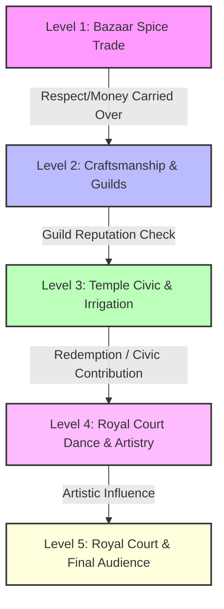

# 👑 VIJAYANAGARA EMPIRE: AI-POWERED STORYTELLING VR SYSTEM

This document serves as the master blueprint and comprehensive gameplay system specification for the **AI-Enabled Storytelling VR Project**. It details the structural design of all gameplay levels, global mechanics (Money and Respect), progression algorithms, and future design paths.

> [!NOTE]
> **LLM CONTEXT GUIDE**: If context is ever cleared or a new LLM is loaded, copy and paste this entire file as the system prompt or core architectural reference.

---

## 🏛️ OVERALL SYSTEM ARCHITECTURE

The gameplay is set in the 1500s during the golden age of the **Vijayanagara Empire** under **Emperor Krishnadevaraya**. The player takes the role of a traveling merchant/artisan who progresses through five distinct thematic levels, representing different societal layers of the empire.

### 🔄 The 5 Storytelling Levels

1. **Level 1: Bazaar Spice Trade (Negotiation & Trading)**
   * **Context**: The player sets up a stall in Hampi's bustling Virupaksha Bazaar to sell high-value spices (pepper, clove, cinnamon, cardamom) to various international and local buyers.
   * **Core Challenge**: Dynamic pricing negotiation against distinct buyer personalities (Cautious Buyer, Aggressive Trader, Polite Merchant).
   * **Global Impact**: Sets the player's initial capital (`total_varahas`) and starting reputation (`reputation` / Respect).

2. **Level 2: Craftsmanship & Guilds (Quality & Rules)**
   * **Context**: The player is hired by the local Weaver's Guild (Seni) to dye and weave exquisite textiles for export.
   * **Core Challenge**: Understanding material constraints, adhering to royal guild officer regulations, and managing trade-offs between speed, cost, and high quality.
   * **Dynamic Influence**: High respect from Level 1 grants entry to premium silk dye recipes; low respect results in cold welcomes and rigid guild pricing.

3. **Level 3: Temple Civic & Irrigation (Resource Allocation & Duty)**
   * **Context**: The player is commissioned to design irrigation canals near the Hampi Daroji reservoir or construct a grand stone temple pillar (temple acted as Hampi's municipal bank and landowner).
   * **Core Challenge**: Balancing community welfare, worker wages, and physical structure durability against royal deadlines.
   * **Redemption Opportunity**: The core **Redemption Loop** operates here. Players who arrived with low reputation or low money can work selflessly, taking lower profits to restore their respect score in the eyes of Hampi's elders.

4. **Level 4: Royal Court Dance & Artistry (Etiquette & Expression)**
   * **Context**: The player presents traditional performance arts (classical dance or sculpting) at the Mahanavami Dibba platform during the 9-day spring festival.
   * **Core Challenge**: Navigating complex social hierarchies, matching artistic expressions with royal aesthetics, and utilizing high-class courtly etiquette.
   * **Global Impact**: Massive potential modifiers for final respect scores depending on the player's performance before the court nobles.

5. **Level 5: Royal Court & Final Audience (Judgment & Destiny)**
   * **Context**: The player is summoned before Emperor Krishnadevaraya for a final audience.
   * **Core Challenge**: Defending their record, presenting their wealth and craftsmanship, and responding to high-stakes political questions.
   * **Outcome**: A dynamic branch-ending depending on global metrics (e.g. Royal Treasurer appointment, Exiled Trader, Temple Guild Patron, or Trusted Court Advisor).

---

## 📈 GLOBAL PROGRESSION METRICS

Progression is tracked using two global metrics saved to disk serialization under `memory/sessions/[session_id].json`.

### 💰 1. Global Money (`total_varahas`)
* **Standard Unit**: **Varaha** (Gold coin). Fractional denominations include:
  * **Pratapa** (0.5 varaha)
  * **Hana** (0.1 varaha)
  * **Tara** (fractional silver coin)
* **Initial Capital**: Player starts with **100 varahas**.
* **Level 1 Earning Formulas**:
  * For each successfully negotiated trade (`ACCEPT`):
    $$\text{total\_varahas} \leftarrow \text{total\_varahas} + P_{\text{final}}$$
    Where $P_{\text{final}}$ is the final agreed price of the transaction.
  * If a transaction fails (`WALK_AWAY` or `NO_ITEM`), money remains unchanged.

### 🤝 2. Global Respect (`reputation`)
* **Standard Scale**: **0 to 100**.
* **Initial Reputation**: Player starts with **50**.
* **Reputation Archetypes**:
  * **$\ge 80$**: `"Fair Trader"` — NPCs greet warmly, extend credit, and offer rare blueprints.
  * **$35 \text{ to } 79$**: `"Standard Merchant"` — standard pricing and dialogue.
  * **$\le 34$**: `"Greedy Haggler"` — NPCs are defensive, prices are highly rigid, and special features are locked.
* **Level 1 Respect Formulas**:
  * Respect changes dynamically upon completion of each spice negotiation:
    * **Successful Deal (`ACCEPT`)**:
      * **Exceptional Trust**: If NPC trust $\ge 0.7$ and frustration $\le 0.3$:
        $$\text{reputation} \leftarrow \min(100, \text{reputation} + 15)$$
      * **High Frustration**: If NPC frustration $\ge 0.6$:
        $$\text{reputation} \leftarrow \max(0, \text{reputation} - 10)$$
      * **Standard Deal**:
        $$\text{reputation} \leftarrow \min(100, \text{reputation} + 5)$$
    * **Failed Negotiation (`WALK_AWAY` / NPC leaves)**:
      * Standard walk-away penalty:
        $$\text{reputation} \leftarrow \max(0, \text{reputation} - 15)$$
    * **Behavioral Penalties**:
      * **Out of World Dialogues**: If the player makes out-of-character or modern remarks (tracked by `out_of_world_count`):
        $$\text{reputation} \leftarrow \max(0, \text{reputation} - 10 \times \text{out\_of\_world\_count})$$

---

## 🔄 REDEMPTION MECHANICS

A core element of the storytelling philosophy is **Redemption**. Players who make mistakes, cheat, or get greedy in earlier stages are not locked out of a good ending, but must actively work to restore their standing.

### The Level 3 Civic Restoration Loop
In Level 3 (Temple Civic & Irrigation), the player can choose:
* **The Mercenary Path**: Maximize short-term profit by cutting worker wages and purchasing cheap, unstable stone blocks. (Money increases massively, but Respect drops to critical levels).
* **The Civic Path (Redemption)**: The player can work for Hampi's Temple Corporation at cost, donating their craftsmanship and paying workers generous wages.
  * **Calculation**:
    * If player profit is voluntarily kept $\le 10$ varahas, and structural quality is exceptional:
      $$\text{reputation} \leftarrow \min(100, \text{reputation} + 35)$$
      *This completely redeems a "Greedy Haggler", moving them back into "Standard Merchant" or "Fair Trader" standing!*

---

## 🛠️ BLUEPRINT FOR FUTURE LEVEL IMPLEMENTATIONS

When implementing Level 2, Level 3, etc., future LLMs and developers must strictly follow this structure:

### 📁 Directory Layout per Level
Create a corresponding folder under `backend/npc_engine/levels/level[N]_[name]/`:
* **`intent_classifier.py`**: Custom regex and local prompts for identifying intents specific to that level (e.g. weaving instructions in L2, canal engineering in L3).
* **`dialogue_generator.py`**: A dialogue renderer that utilizes RAG facts from `knowledge/vijayanagara_facts.json` corresponding to that level's connections.
* **`level_engine.py`**: State machine that manages turn thresholds, satisfaction, quality indicators, and output outcomes.

### 📝 Integration Checklists
1. **Never Break Unity API Contracts**:
   * Keep endpoints `/start` and `/step` universal.
   * Pass session state parameters (`action`, `npc_text`, `done`, `debug`, `price`, `quantity`) seamlessly.
2. **Commit Disk State immediately**:
   * Always call `persistence.py` to write state updates at the end of each session step or level conclusion.
3. **Use the Keyword-based RAG**:
   * Pull historical facts from `knowledge/vijayanagara_facts.json` to ground LLM dialogues in true 16th-century terms.

---

*This blueprint guarantees a highly scalable, cohesive, and deeply immersive educational VR storytelling experience set in the golden age of South India.*
