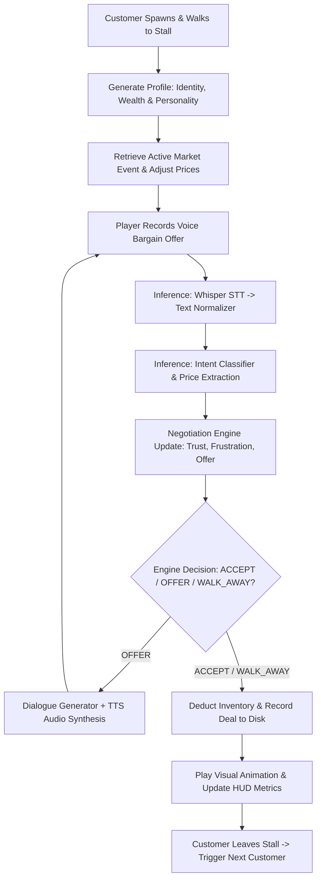
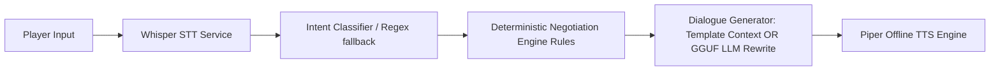

# Level 1 Marketplace - Complete Design Documentation

This document provides a comprehensive analysis of the gameplay design and technical architecture of the Level 1 Marketplace in the AI-Enabled Storytelling VR project. It describes the state systems, math formulas, AI generation logic, and Unity manager pipelines.

---

## 1. Level Overview

### Purpose & Player Role
In Level 1, the player acts as a spice merchant in the bustling **Krishna Bazaar** of the historical **Vijayanagara Empire (circa 1500s Hampi)**. The player's goal is to negotiate spice sales with customers of varying backgrounds, maximize profits (measured in **Varahas**), and build a stellar commercial reputation (measured in **Merchant Honour**).

### Historical Context & Learning Objectives
*   **Krishna Bazaar**: A major commercial hub of Hampi famous for international trade.
*   **Spices**: Trade commodities include Black Pepper, Cloves, Cinnamon, and Cardamom.
*   **Traditional Metrics**: The game educates players in traditional Indian metrics (e.g., *Veesai*, *Seer*, *Palam*) instead of modern grams or kilograms.

### Main Gameplay Loop


---

## 2. Player State System

### Starting Values
At the start of a fresh session, the player's metrics and inventory are initialized to these exact default values:

| Metric | Code constant | Initial Value |
| :--- | :--- | :--- |
| **Merchant Honour (Reputation)** | `DEFAULT_REPUTATION` | `50` (on a scale of 0 to 100) |
| **Varahas (Currency)** | `DEFAULT_VARAHAS` | `100` |
| **Black Pepper Stock** | - | `15000.0 g` (15 kg) |
| **Cloves Stock** | - | `8000.0 g` (8 kg) |
| **Cinnamon Stock** | - | `12000.0 g` (12 kg) |
| **Cardamom Stock** | - | `4000.0 g` (4 kg) |

### Persistence & Session Handling
*   **File Storage**: Sessions are written to local disk under `memory/sessions/<session_id>.json`.
*   **Player Profile**: Global progress across sessions is saved in `memory/sessions/player_profile.json`.
*   **Atomic Saves**: Writing the player profile uses atomic file replacement: writes to a temporary file (`player_profile.tmp`), verifies the JSON format, backups the existing profile to `player_profile.backup.json`, and then replaces the live file.
*   **Reset Behavior**: If `DEV_RESET_PROFILE = True` (defined in `persistence.py`), the system bypasses disk loading on startup and resets the player to the default initial values.

---

## 3. Customer/NPC Generation

Each customer approaching the stall is generated dynamically on session creation.

### Spawn Weights
The customer's wealth class is selected using weighted probabilities dependent on the player's current **Merchant Honour**:

*   **Low Honour ($\le 40$)**: Cheap: `60%` | Normal: `35%` | Rich: `5%`
*   **Medium Honour ($41 - 70$)**: Cheap: `25%` | Normal: `55%` | Rich: `20%`
*   **High Honour ($> 70$)**: Cheap: `5%` | Normal: `35%` | Rich: `60%`

### Wealth Classes
*   **Cheap** $\rightarrow$ Wealth: `"Low"`
*   **Normal** $\rightarrow$ Wealth: `"Medium"`
*   **Rich** $\rightarrow$ Wealth: `"High"` or `"Very High"`

### Personality Types & Attributes
Each customer receives one of five personalities which defines their desperation, patience, and politeness parameters:

| Personality | Desperation Range | Patience Range | Politeness Range |
| :--- | :--- | :--- | :--- |
| **strict** | `0.3 - 0.6` | `0.3 - 0.5` | `0.2 - 0.4` |
| **friendly** | `0.4 - 0.7` | `0.6 - 0.9` | `0.7 - 0.95` |
| **wealthy trader** | `0.5 - 0.8` | `0.5 - 0.8` | `0.6 - 0.9` |
| **impatient** | `0.5 - 0.9` | `0.2 - 0.4` | `0.3 - 0.5` |
| **curious traveler** | `0.3 - 0.6` | `0.7 - 0.95` | `0.7 - 0.9` |

### Attribute Adjustments
1.  **Wealth on Patience**:
    *   Low Wealth: `patience = max(0.1, patience * 0.75)`
    *   Medium Wealth: No change
    *   High/Very High Wealth: `patience = min(1.0, patience * 1.20)`
2.  **Reputation on Patience & Turns**:
    *   Honour $< 26$ (Poor): `patience = max(0.1, patience - 0.25)`, `max_rounds = max(3, max_rounds - 2)`
    *   Honour $> 75$ (Excellent): `patience = min(1.0, patience + 0.20)`, `max_rounds = min(10, max_rounds + 2)`
3.  **Negotiation Rounds**: The maximum turns a buyer will tolerate is calculated as:
    $$\text{max\_rounds} = \lfloor 4 + \text{patience} \times 6 \rfloor$$

### Customer Identities
The database selects from five predefined historical identities:
1.  **Abdul Rahman**: Persian Spice Merchant (Interests: Pepper)
2.  **Francisco de Almeida**: Portuguese Trade Agent (Interests: Cinnamon)
3.  **Chinappa Naik**: Vijayanagara Wholesale Buyer (Interests: Cloves)
4.  **Siddharth Chetti**: Local Retail Shopkeeper (Interests: Cardamom)
5.  **Father Penteado**: Jesuit Missionary (Interests: Cinnamon)

---

## 4. Spice Economy System

The marketplace economy uses baseline pricing modified by active demand events:

### Spices Catalog
| Spice | Base Price / Unit (kg) | Default Market Multiplier | Standard Market Price / Unit (kg) | Starting Inventory |
| :--- | :--- | :--- | :--- | :--- |
| **Pepper** | `80 Varahas` | `1.2` | `96 Varahas` | `15.0 kg` |
| **Clove** | `70 Varahas` | `1.3` | `91 Varahas` | `8.0 kg` |
| **Cinnamon** | `80 Varahas` | `1.3` | `104 Varahas` | `12.0 kg` |
| **Cardamom** | `100 Varahas` | `1.5` | `150 Varahas` | `4.0 kg` |

### Market Events
During session startup, there is a **35% chance** that a random market event occurs, applying temporary multipliers to the current spice:

*   **Portuguese Caravan Arrival**: Demand for Pepper skyrockets!
    *   Affected: `pepper` | Price Multiplier: `1.35` | Quantity Multiplier: `1.5`
*   **Temple Chariot Festival**: Religious offerings demand cloves in massive amounts!
    *   Affected: `clove` | Price Multiplier: `1.25` | Quantity Multiplier: `1.3`
*   **Krishna Bazaar Wholesale Demand**: Cardamom stocks wanted for bulk shipments!
    *   Affected: `cardamom` | Price Multiplier: `1.2` | Quantity Multiplier: `1.4`
*   **Malabar Monsoon Deluge**: Southern supply roads flooded! Cinnamon is restricted!
    *   Affected: `cinnamon` | Price Multiplier: `1.4` | Quantity Multiplier: `0.5`

### Calculation Formulas
*   **Base Cost**:
    $$\text{base\_cost} = \text{base\_price\_per\_unit} \times \text{quantity (kg)}$$
*   **Market Price per Unit**:
    $$\text{market\_price\_per\_unit} = \text{base\_price\_per\_unit} \times \text{market\_multiplier}$$
*   **Market Price**:
    $$\text{market\_price} = \text{market\_price\_per\_unit} \times \text{quantity (kg)}$$
*   **Market Event Adjustment**: If an event affects the active spice:
    $$\text{market\_price} = \lfloor \text{market\_price} \times \text{event\_price\_multiplier} \rceil$$

---

## 5. Bargaining System

### The Negotiation Pipeline
1.  **Speech Recording**: Player holds Right Trigger on Quest controller (or V on keyboard) to capture microphone audio.
2.  **STT Transcription**: Audio WAV bytes are uploaded to `/stt` where Whisper transcribes them.
3.  **Text Normalization**: Transcript numbers and currency units are normalized to plain integers.
4.  **Intent Classification**: Intent is classified into negotiation tokens (`PRICE`, `COUNTER`, `REJECT`, `ULTIMATUM`, `HOSTILE`, etc.).
5.  **Bargain Evaluation**: The `NegotiationEngine` runs math rules to adjust buyer variables and issue a decision.
6.  **Response Synthesis**: The `DialogueGenerator` formats dialogue text, and Piper compiles it to audio.
7.  **Unity Update**: Unity plays the voice file, plays visual reactions, and updates the HUD.

### Price Budgets
*   **Max Budget** (`compute_max_price`): The maximum price a customer will ever pay:
    *   Low Wealth: $\text{market\_price} \times \text{random}(0.9, 1.0)$
    *   Medium Wealth: $\text{market\_price} \times \text{random}(1.1, 1.25)$
    *   High/Very High Wealth: $\text{market\_price} \times \text{random}(1.3, 1.6)$
*   **Initial Customer Offer** (`initial_offer`): The first price a customer proposes:
    *   Low Wealth: $\text{market\_price} \times \text{random}(0.6, 0.8)$
    *   Medium Wealth: $\text{market\_price} \times \text{random}(0.75, 0.9)$
    *   High/Very High Wealth: $\text{market\_price} \times \text{random}(0.9, 1.1)$

### Counter-Offer Increment Calculation
When countering, the buyer increases their offer by a calculated increment:
$$\text{increment} = \text{gap} \times \text{stage\_resistance} \times \text{frustration\_multiplier} \times \text{desperation\_multiplier} \times \text{trust\_multiplier} \times \text{interest\_multiplier} \times \text{quantity\_multiplier} \times \text{anchor\_multiplier}$$

Where:
*   $\text{gap} = \text{player\_requested\_price} - \text{current\_offer}$
*   **Stage Resistance**: `OPENING = 0.2` | `BARGAINING = 0.32` | `FINALIZATION = 0.45`
*   $\text{frustration\_multiplier} = 1.0 + (\text{frustration} \times 0.25)$
*   $\text{desperation\_multiplier} = 0.9 + (\text{buyer.desperation} \times 0.45)$
*   $\text{trust\_multiplier} = 0.85 + (\text{trust} \times 0.3)$ (strict modifiers apply based on strict/friendly traits)
*   $\text{quantity\_multiplier}$: Small quantity ($<200g$) = `0.75` | Bulk quantity ($>1000g$) = `1.12` | Else = `1.0`

The increment is clamped:
$$\text{min\_increment} = \max(2, \lfloor 0.02 \times \text{market\_price} \rfloor)$$
$$\text{increment} = \max(\text{min\_increment}, \min(\text{increment}, \lfloor \text{gap} \times 0.6 \rfloor))$$

### Acceptance Verification (`can_accept_now`)
The buyer accepts the player's offer if and only if **all** of the following conditions are met:
1.  **No Block Flag**: `should_block_accept` must be False (fails if frustration $\ge$ personality threshold or `hostile_count` $\ge 2$).
2.  **Started**: `started = True` and `deal_locked = False`.
3.  **Stage**: Must be in `"FINALIZATION"` (meaning `current_offer` $\ge 90\%$ of `max_price`). If in earlier stages, the offer is only accepted if `player_price` $\le$ `current_offer`.
4.  **Acceptance Threshold**: The player's price must be $\le$ the customer's `acceptable_price()`:
    $$\text{acceptable\_price} = \text{max\_price} \times (0.9 - 0.3 \times \text{buyer.desperation})$$
5.  **Seller Minimum Price**: The offer must be $\ge$ `seller_min_price` (set if the player has given an ultimatum).

---

## 6. Reputation System

Merchant Honour ranges from **0 to 100**. It is calculated based on transaction results and behavior:

### Deal Outcome Formulas
*   **Successful Trade (ACCEPT)**:
    *   Base increase: `+2` Honour
    *   *Bonus* for selling above market price (`final_price > market_price`): `+2` Honour
    *   *Bonus* for high customer satisfaction (`trust >= 0.7` and `frustration <= 0.3`): `+1` Honour
    *   *Penalty* if the customer leaves frustrated (`frustration >= 0.6`): Sets reputation change to `-5` Honour
*   **Failed Trade (WALK_AWAY / REJECT)**:
    *   If customer left angry (`frustration >= 0.6` or exit by walkaway): `-5` Honour
    *   Normal walkaway: `-3` Honour
*   **Out of Character/World Penalty**:
    *   `-10` Honour for **each** detected modern/out-of-world phrasing (`out_of_world_count`).

### Reputation Bounds & Ranks
Merchant Honour is clamped at runtime: `max(0, min(100, new_reputation))`.

| Honour Score | Reputation Rank Name |
| :--- | :--- |
| **0 - 20** | `"Unknown Trader"` |
| **21 - 40** | `"Small Merchant"` |
| **41 - 60** | `"Trusted Merchant"` |
| **61 - 80** | `"Royal Supplier"` |
| **81 - 100** | `"Legendary Merchant"` |

---

## 7. Money / Varaha System

*   **Varahas**: The baseline currency of the Vijayanagara Empire.
*   **Balance Limit**: Clamped at a minimum of `0` (cannot go negative).
*   **Transaction Logic**:
    *   On Trade Acceptance:
        $$\text{Varahas}_{\text{after}} = \text{Varahas}_{\text{before}} + \text{agreed\_price}$$
    *   On Trade Failure / Walkaway:
        $$\text{Varahas}_{\text{after}} = \text{Varahas}_{\text{before}}$$
*   **Profit Calculation**: Profit shown in UI ledger is calculated as:
    $$\text{profit} = \max(0, \text{agreed\_price} - \text{base\_price\_per\_unit} \times \text{quantity\_kg})$$

---

## 8. AI Architecture



### LLM Integration
*   **Model**: Uses a local quantized Llama 3 8B Instruct model (`models/model.gguf`) loaded via `llama-cpp-python`.
*   **Offloading**: Attempts GPU execution (full or partial layers) using CUDA, falling back to CPU if hardware is incompatible.
*   **Fallback Heuristics**: If the GGUF model is not found, the system falls back to a deterministic rule-based dialogue template builder, guaranteeing zero-crash operation.
*   **Role of LLM**: The LLM acts as a creative rewriter. It takes deterministic variables from the `NegotiationEngine` (e.g. current offer price, stage, customer name, active market event) and rewrites base dialogue templates into immersive, historically-accurate English, injecting specific customer personalities.

---

## 9. Speech System

### Voice Capture Pipeline
1.  **Unity Capture**: [Level1VoiceInputManager.cs](file:///g:/Users/chitr/Desktop/Capstone/AI-Enabled-Storytelling-VR/unity/StorytellingVR/Assets/_Project/Scripts/Level1/Level1VoiceInputManager.cs) records raw microphone input into a `UnityEngine.AudioClip` (sampled at 16000Hz, single channel).
2.  **WAV Encoding**: Encodes the recording clip into a 16-bit PCM short WAV byte array.
3.  **Multipart Upload**: Uploads WAV bytes to `/stt` endpoint via `UnityWebRequest`.
4.  **Speech Normalization**: Whisper converts audio to text, and the backend normalizes:
    *   Text conversions: E.g., "one" $\rightarrow$ "1", "a" $\rightarrow$ "1".
    *   Traditional unit normalization: Converts token references (e.g., "three veesai") into matching numeric gram calculations.
    *   Currency token mapping: Matches spoken bazaar currencies to Varaha counts.

---

## 10. API Documentation

Exposed routes on the FastAPI backend (running on port `8000`):

### 1. `POST /start`
*   **Input**: None (Empty JSON)
*   **Output**: Session details (ID, active event, generated NPC, spice details, persistent player stats).
*   **Purpose**: Initializes a new customer negotiation session.

### 2. `POST /step`
*   **Input**:
    ```json
    {
      "session_id": "string",
      "player_input": "string"
    }
    ```
*   **Output**: Negotiation results (NPC dialogue, accepted/offered price, current metrics).
*   **Purpose**: Progresses the negotiation with player dialogue.

### 3. `WEBSOCKET /ws/negotiate/{session_id}`
*   **Input/Output**: Duplex JSON messages.
*   **Purpose**: High-QoS real-time communication channel for VR headset clients.

### 4. `POST /stt`
*   **Input**: WAV audio file.
*   **Output**:
    ```json
    {
      "text": "transcribed and normalized string"
    }
    ```
*   **Purpose**: Offline speech-to-text transcription.

---

## 11. Unity Architecture

Level 1 scripts communicate via decoupled references:

*   **MarketplaceManager**: Manages NPC spawns, NavMesh locomotion paths, animation transitions, and session lifecycles.
*   **ChatManager**: Manages player text inputs, hooks into API requests, triggers audio playback, and tells managers when responses arrive.
*   **APIManager**: Serializes HTTP requests and parses JSON responses from the backend FastAPI server.
*   **Level1VoiceInputManager**: Handles hardware microphone recording, translates WAV streams, and communicates with the STT endpoint.
*   **Level1HUDManager**: Controls UI panels, runs slider/ledger animations, and formats screen labels.
*   **BazaarFeedbackManager**: Manages floating coins, thinking animation state machines, and toast displays.
*   **NPCGazeController**: Programmatically rotates head bones to dynamically target the player or the spice tables.

---

## 12. UI/HUD System

*   **NPC Intro Card**: Appears above the stall for 3 seconds upon customer arrival, displaying name and trade origin.
*   **Current Trade Panel**: Displays the current spice name, quantity, the buyer's offer, and the baseline market value.
*   **Economy HUD**: Displays current Varahas and Merchant Honour rank.
*   **Reputation Bar**: Interactive slider showing Honour value. Displays a floating `+X Honour` or `-X Honour` text popup when values change.
*   **Ledger Screen**: Appears on TAB, displaying detailed transaction history, profits, and cumulative shift summaries.

---

## 13. Scene Integration

The complete sequential demo flow is configured as follows:

```
0 Bootstrap (GameManager & Scene Manager Setup)
  ↓
1 SpicesIntro (Teach spice varieties)
  ↓
2 TraderIntroScene (Teach market environment)
  ↓
3 Transcation_Tutorial (Teach trade hud interfaces)
  ↓
4 CoinScene (Teach coin verification)
  ↓
5 MainScene1 / MainScene1_PreVRBackup (Level 1 Marketplace Bargaining)
```
*Level 1 gameplay begins at scene index 5.*

---

## 14. VR Implementation

### Camera Rig
*   Uses **OVRCameraRig** from the Meta XR Core SDK.
*   Tracking origin set to `Eye Level` for consistent floor height calibration.

### VR Controls
*   **Right Trigger**: Hold to activate microphone capture; release to submit audio WAV to Whisper.
*   **A Button (Right Controller)**: Confirms the transcribed text and sends it to the customer.
*   **B Button (Right Controller)**: Resets or clears the current text box to retry.

### UI Canvas
*   Uses **World Space Canvas** mapped to curved visual locations surrounding the player's counter, optimizing readability inside the headset.

---

## 15. Example Full Gameplay Walkthrough

### 1. Setup
*   Player has `100 Varahas`, `50 Honour (Trusted Merchant)`.
*   Inventory has `15000g` Pepper.

### 2. Arrival
*   **Abdul Rahman** (Persian Spice Merchant, wealth: `"Medium"`) approaches.
*   He wants **1 Veesai (~1.4 kg)** of Pepper.
*   Market price of 1 Veesai is `134 Varahas` (base price 80/kg $\times$ 1.2 multiplier $\times$ 1.4 kg).
*   Abdul Rahman's maximum budget is set to `154 Varahas` ($\text{market\_price} \times 1.15$).
*   His initial offer is `107 Varahas` ($\text{market\_price} \times 0.8$).

### 3. Negotiation
*   Abdul Rahman: *"I wish to purchase 1 Veesai of pepper. I can offer 107 Varahas."*
*   Player (Voice): *"I want 150 Varahas for this pepper."*
*   Whisper STT transcribes and extracts price `150`.
*   Negotiation Engine updates:
    *   $\text{gap} = 150 - 107 = 43$.
    *   Buyer increases offer by counter increment $\text{increment} = 11$.
    *   New offer: `118 Varahas`.
*   Abdul Rahman: *"150 is steep. How about 118 Varahas instead?"*
*   Player (Voice): *"Let's do 140 Varahas."*
*   Negotiation Engine calculates new increment: `13`.
*   New offer: `131 Varahas`.
*   Abdul Rahman: *"I can go up to 131 Varahas. That is my best offer."*
*   Player (Voice): *"Okay, I accept 131 Varahas."*
*   The deal is accepted.

### 4. Transaction Resolution
*   Abdul Rahman animation triggers `"happy"`.
*   **Varahas Update**: $+131 \rightarrow$ Player has `231 Varahas`.
*   **Honour Update**:
    *   Deal Accepted: `+2`
    *   No anger or out of character talk.
    *   New Honour: `52`.
*   **Inventory Update**: $-1400g$ $\rightarrow$ Player has `13600g` Pepper.
*   Abdul Rahman walks to the exit point and despawns.

---

## 16. Important Constants Appendix

```python
# Starting Metrics
DEFAULT_REPUTATION = 50
DEFAULT_VARAHAS = 100

# Traditional Conversion Constants
PALAM_GRAMS = 35       # 35g
SEER_GRAMS = 280       # 280g
VEESAI_GRAMS = 1400    # 1.4 kg
MANANGU_GRAMS = 11200  # 11.2 kg
BAHAR_GRAMS = 448000   # 448 kg

# Base Spice Prices (Per kg)
PEPPER_BASE = 80
CLOVE_BASE = 70
CINNAMON_BASE = 80
CARDAMOM_BASE = 100

# Base Spice Multipliers
PEPPER_MULTIPLIER = 1.2
CLOVE_MULTIPLIER = 1.3
CINNAMON_MULTIPLIER = 1.3
CARDAMOM_MULTIPLIER = 1.5

# Reputation Threshold bounds
MIN_REPUTATION = 0
MAX_REPUTATION = 100
```
