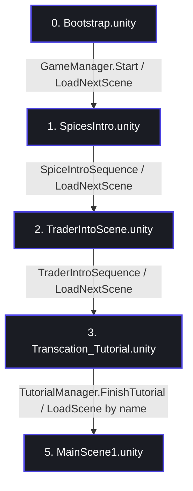

# Full Scene Architecture Audit & VR Readiness Report

This document presents a comprehensive scene component and VR readiness audit of the current application scenes inside the integration branch `integration/tutorial-level1`.

---

## 1. Scene Transition Map

The application progresses sequentially from initialization to Level 1. The transition mechanism utilizes a persistent `GameManager` for narrative/intro scenes and direct scene loading for the tutorial transition.

| Source Scene | Destination Scene | Trigger Script / Method | Transition Mechanism |
| :--- | :--- | :--- | :--- |
| **`Bootstrap`** | `SpicesIntro` | `GameManager.Start()` calling `LoadNextScene()` | Increments index and loads first item in `scenes` array. |
| **`SpicesIntro`** | `TraderIntoScene` | `SpiceIntroSequence.PlaySequence()` | Calls `GameManager.Instance.LoadNextScene()` on narration end. |
| **`TraderIntoScene`** | `Transcation_Tutorial` | `TraderIntroSequence.RunIntro()` | Calls `GameManager.Instance.LoadNextScene()` on intro animation end. |
| **`Transcation_Tutorial`** | `MainScene1` | `TutorialManager.FinishTutorial()` | Calls `SceneManager.LoadScene("MainScene1")` directly by name. |

---

## 2. XR Objects Table

All scenes utilize the **Meta XR SDK / Oculus Integration** rig rather than standard Unity XR Interaction Toolkit (`XROrigin`).

| Scene Name | XR Rig Present | Camera GameObjects & Active States | Active AudioListeners | EventSystem Count | UI Input Module |
| :--- | :--- | :--- | :---: | :---: | :--- |
| **`Bootstrap`** | None (2D Fader) | `Camera` (Active) | 1 (`Camera`) | 1 | `InputSystemUIInputModule` |
| **`SpicesIntro`** | Oculus Rig | `CenterEyeAnchor` (Active) `LeftEyeAnchor` (Active) `RightEyeAnchor` (Active) `Main Camera` (Active) | **2** (`CenterEyeAnchor`, `Main Camera`) | 1 | `InputSystemUIInputModule` |
| **`TraderIntoScene`** | Oculus Rig | `CenterEyeAnchor` (Active) `LeftEyeAnchor` (Active) `RightEyeAnchor` (Active) `Main Camera` (Active) | **2** (`CenterEyeAnchor`, `Main Camera`) | 1 | `InputSystemUIInputModule` |
| **`Transcation_Tutorial`** | Oculus Rig | `CenterEyeAnchor` (Active) `LeftEyeAnchor` (Active) `RightEyeAnchor` (Active) `Main Camera` (Inactive) | **1** (`CenterEyeAnchor`) | 1 | `InputSystemUIInputModule` |
| **`MainScene1`** | Oculus Rig | `CenterEyeAnchor` (Active) `LeftEyeAnchor` (Active) `RightEyeAnchor` (Active) `Main Camera` (Active) | **2** (`CenterEyeAnchor`, `Main Camera`) | 1 | `InputSystemUIInputModule` |

> [!WARNING]
> **AudioListener Violations**: `SpicesIntro`, `TraderIntoScene`, and `MainScene1` contain **two active AudioListeners** (one on `Main Camera` and one on the VR rig's `CenterEyeAnchor`). This causes console errors and spatialized 3D audio rendering bugs. Only `Transcation_Tutorial` complies with the single active AudioListener rule.

---

## 3. Canvas Conversion Checklist

To achieve VR readiness, all non-World Space canvases must be converted.

| Scene | Canvas Name | Current Render Mode | Purpose | Category & Recommendation |
| :--- | :--- | :--- | :--- | :--- |
| **`Bootstrap`** | `FadeCanvas` | Screen Space Overlay | Full-screen fade transition | **Category A: Player-attached UI** Overlay UI does not render correctly in VR. Recommend replacing with a camera-facing World Space quad parented to the VR Camera, or utilizing the Oculus `OVRScreenFade` script. |
| **`SpicesIntro`** | `SubtitleCanvas` | World Space | Narrative speech subtitles | **Category B: Environment UI** Ready. |
| **`SpicesIntro`** | `SpiceInfoCanvas` | World Space | Spice details panel | **Category B: Environment UI** Ready. |
| **`SpicesIntro`** | `NarratorCanvas` | World Space | Narrator dialogue captions | **Category B: Environment UI** Ready. |
| **`TraderIntoScene`** | `NarratorCanvas` | World Space | Narrator dialogue captions | **Category B: Environment UI** Ready. |
| **`Transcation_Tutorial`**| `DisplayCanvas` | World Space | Dialogue, respect, coins HUD | **Category B: Environment UI** Ready. |
| **`Transcation_Tutorial`**| `NarratorCanvas` | World Space | Narrator captions | **Category B: Environment UI** Ready. |
| **`Transcation_Tutorial`**| `CostPriceCanvas` | World Space | Spice cost display | **Category B: Environment UI** Ready. |
| **`MainScene1`** | `ScreenHUDCanvas` | **Screen Space Overlay** | Main player HUD (Varahas, honour, trade items, voice status, ledger) | **Category A/B/C: Player-attached & Interaction UI** _CRITICAL INCOMPATIBILITY_. Overlay rendering is unreadable and breaks in VR. Must be converted to **World Space** and positioned as a physical merchant ledger/board or attached to the player's wrist. |
| **`MainScene1`** | `WorldHUDCanvas` | **Screen Space Camera** | NPC floating name/origin info | **Category B: Environment UI** _CRITICAL INCOMPATIBILITY_. Screen Space Camera causes head-locked jitter. Must be converted to **World Space** and placed directly above the NPC's head. |

---

## 4. Manager Configuration Audit

We mapped all manager scripts and categorized them to evaluate redundancy.

### Persistent Managers
- **`GameManager`** (GameObject: `GameManager` in `Bootstrap`)
  - **Script**: `GameManager` + `SceneSkipTester`
  - **Lifetime**: Instantiated in Bootstrap and persists via `DontDestroyOnLoad`. Manages the scene progression indices and handles screen fader coordination.

### Scene-Specific Managers

- **`SpicesIntro`**:
  - `SpiceIntroSequence` (GameObject: `SpiceIntroManager`): Narrative flow sequence script.
  - `TutorialManager` (GameObject: `NarratorCanvas`): **Warning**: A duplicate instance of `TutorialManager` exists in this scene with unassigned references.
- **`TraderIntoScene`**:
  - `TraderIntroSequence` (GameObject: `TutorialManager`): Intro movement and camera transition sequencer.
  - `TutorialManager` (GameObject: `NarratorCanvas`): **Warning**: Duplicate instance.
- **`Transcation_Tutorial`**:
  - `TutorialManager` (GameObject: `TutorialManager`): Controls narrator slides, price checks, and dialogue boxes.
  - `RespectUIManager` (GameObject: `RespectPanel`): Updates bargaining respect slider feedback.
  - `VoiceRecognitionManager` (GameObject: `VoiceRecognitionManager`): Connects Wit.ai / Oculus Voice SDK to trigger bargaining words.
  - `AppVoiceExperience` (GameObject: `VoiceRecognitionManager`): Oculus Voice SDK configuration wrapper.
- **`MainScene1`**:
  - `MarketplaceManager` (GameObject: `MarketplaceManager`): Core marketplace controller. Spawns customers, coordinates negotiation states, and handles inventory shifts.
  - `BazaarFeedbackManager` (GameObject: `BazaarFeedbackManager`): Immersive trade outcome effects helper.
  - `Level1VoiceInputManager` (GameObject: `[BuildingBlock] Speech To Text`): Coordinates microphone transcription status updates (Idle, Recording, Review).
  - `APIManager` (GameObject: `GameManager`): Communicates with the FastAPI local negotiation backend.
  - `ChatManager` (GameObject: `GameManager`): Oversees transcript logs, TTS playback, and user/NPC response routing.
  - `AudioManager` (GameObject: `GameManager`): Drives environmental soundscapes and narration clips.

---

## 5. VR Readiness Risk List

### Critical Mismatches & Technical Debt

1. **Active Redundant Desktop Cameras (Performance Overkill)**
   - **Risk**: `SpicesIntro`, `TraderIntoScene`, and `MainScene1` have the default desktop `Main Camera` active alongside the Oculus `OVRCameraRig`'s left/right/center eye anchors. 
   - **Impact**: The engine renders the entire scene geometry twice (once for desktop viewport, once for the headset), reducing VR frame rates. On standalone hardware (Meta Quest), this will cause severe performance degradation and stuttering.
   - **Resolution**: Disable or remove the desktop `Main Camera` in scenes when the OVR rig is present, as done in `Transcation_Tutorial`.

2. **Duplicate AudioListeners (3D Spatialization Breakdown)**
   - **Risk**: `SpicesIntro`, `TraderIntoScene`, and `MainScene1` contain two active `AudioListener` components.
   - **Impact**: Unity prints warnings to the console. 3D spatialized audio attenuation breaks because Unity cannot determine which active listener to calculate distance vectors from.
   - **Resolution**: Keep ONLY the `AudioListener` on the VR camera (`CenterEyeAnchor`) active.

3. **VR-Incompatible UI Render Modes (MainScene1 HUD)**
   - **Risk**: `ScreenHUDCanvas` uses `Screen Space Overlay` and `WorldHUDCanvas` uses `Screen Space Camera`.
   - **Impact**: Screen Space Overlay renders on top of the user's eye displays as a flat plane, rendering in double vision or becoming completely clipped. Screen Space Camera locks to the head position, causing visual jitter and tracking discomfort.
   - **Resolution**: Convert both to `World Space` canvases. Mount `ScreenHUDCanvas` on a virtual desk/board or the player's wrist, and float `WorldHUDCanvas` above the NPC.

4. **Camera Height & Scale Discrepancies (Height Snap)**
   - **Risk**: The local height (Y position) of `[BuildingBlock] Camera Rig` varies across scenes:
     - `SpicesIntro`: **2.56m**
     - `TraderIntoScene`: **2.646m**
     - `Transcation_Tutorial`: **2.43m**
     - `MainScene1`: **2.67m**
   - **Impact**: When transitioning between scenes, the player's physical viewpoint will snap upward or downward by up to 24cm, creating a disorienting user experience.
   - **Resolution**: Normalize all Camera Rig heights to a standard value (e.g. `2.5m` or local tracking floor origin `0.0m` if height calibration is handled dynamically).

5. **Stale / Missing Script References (Technical Debt)**
   - **Risk**: `SpicesIntro` and `TraderIntoScene` contain components of class `TutorialManager` pointing to the GUID `42fb33946cca7fa4083f66b3b745511f` which does not exist in the project files.
   - **Impact**: Unity displays "Missing (MonoBehaviour)" script warnings in the inspector, resulting in unnecessary memory overhead and runtime warning spam.
   - **Resolution**: Remove these stale component references from the scenes.

6. **Locomotion Implementation Gap**
   - **Risk**: There are no teleportation, snap turn, or continuous locomotion setups in any active scene.
   - **Impact**: While appropriate for a standing shopkeeper demo, players cannot adjust their position relative to the market tables if they spawn slightly off-center.
   - **Resolution**: Confirm if static standing orientation is the final design. If not, add basic snap turning.
