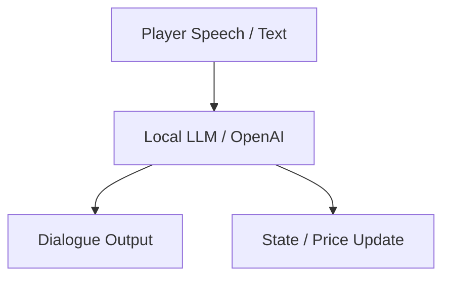
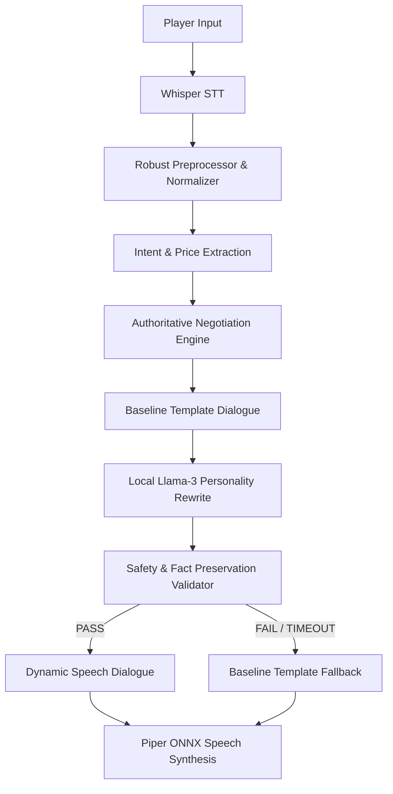

# AI Architecture Evolution: Hybrid Authoritative Design

This document details the architectural progression of the Vijayanagara AI NPC conversation engine, illustrating how it evolved from a direct LLM-controlled system to a robust, hybrid authoritative architecture.

## 🛠️ The Naive Approach: Direct LLM Control (Phase 1)

In early development stages, the NPC's negotiation strategy and dialogue were controlled entirely by the LLM. The system prompt described the merchant's personality, target price, and minimum price, prompting the LLM to decide on actions (offers, counters, agreements) and write speech in a single call.

### Why Direct LLM Control Failed
1. **Economic Hallucinations**: Despite system prompts instructing the LLM never to sell below 80 varahas, emotional player inputs (e.g. pleading, insults) regularly caused the LLM to agree to prices like 40 varahas or hallucinate numbers like 1,000 varahas.
2. **State Desynchronization**: The LLM frequently forgot the current turn number, active spice, or previously agreed-upon quantities.
3. **High Latency**: Instructing the LLM to perform logical reasoning, math, and dialogue styling in a single prompt led to high token generation times and slow responses (~4-6 seconds per turn).

---

## 🏛️ The Solution: Authoritative Hybrid Architecture (Phase 2)

To resolve these failure modes, the system was refactored into a **Hybrid Authoritative Architecture**. In this design, a deterministic, state-based negotiation engine holds sole authority over mathematical variables, inventory updates, and negotiation states. The LLM is demoted to a pure styling and personality translation layer.

### Components of the Hybrid Architecture

1. **Deterministic Authority**:
   - The `NegotiationEngine` tracks variables: `market_price`, `max_price`, `current_offer`, `turns`, `frustration`, and `trust`.
   - It performs all economics (calculating increments, adjusting budget thresholds, tracking impatience).
2. **Modular NLP Parsing**:
   - `input_interpreter.py` extracts prices and quantity structures using regex/deterministic methods.
   - `intent_classifier.py` and `conversation_understanding.py` classify inputs into discrete player actions (e.g. `PRICE`, `ACCEPT`, `REJECT`).
3. **Stylistic LLM Translation**:
   - The engine selects a baseline response template (e.g. `"The spices in Hampi are fine, but <<<PRICE_VALUE_DO_NOT_CHANGE>>> varahas is all I can offer today."`).
   - The local LLM (`model.gguf`) rewrites this baseline text to fit the character's voice (e.g. Persian Trader, Jesuit Missionary) without modifying placeholders.
4. **Safety & Fact Validator**:
   - Before outputting LLM text, a verification layer checks:
     * Fact Preservation: Placeholders like `<<<PRICE_VALUE_DO_NOT_CHANGE>>>` must be intact.
     * Price Consistency: Spoken numbers matching the offer must be preserved.
     * Immersion: Rejects modern slang or terms (e.g., "rupee", "dollar").
     * No Future Accept Leakage: Ensures NPCs don't say "I will buy next time" during an active `ACCEPT` step.
   - If any check fails, the system safely falls back to the baseline template instantly.
