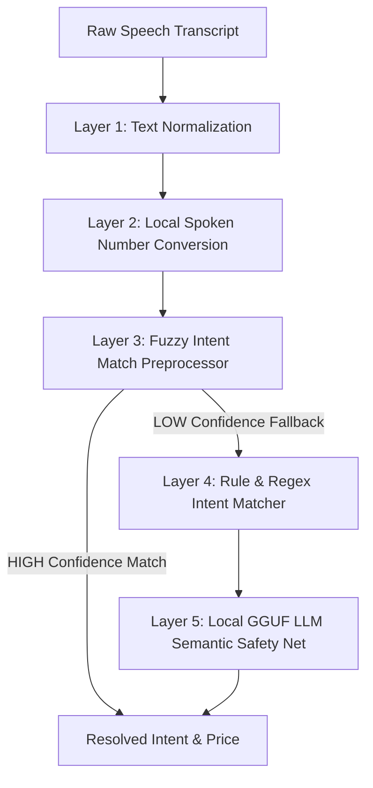

# Conversation Engine Design: Intent Understanding & Preprocessing

This document describes the 5-layer intent understanding engine implemented in `conversation_understanding.py` and its integration with the general conversation pipeline.

## 🏛️ Pipeline Overview

When the player speaks, the transcribed text is processed through multiple levels of filters, normalizations, fuzzy mappings, and LLM classifiers. This sequence prevents rigid keyword mismatches and ensures Whisper homophone/spelling transcriptions map to the correct semantic actions.

---

## 🛠️ The 5-Layer Intent Understanding Architecture

### 1. Layer 1: Text Normalization (`text_normalizer.py`)
- Strips basic punctuation (e.g. `?`, `!`, `.`).
- Standardizes capitalization.
- Corrects common Whisper homophones and corruption errors (e.g., mapping `"for tea five"` to `"forty-five"` or `"advice"` to `"price"` under specific negotiation contexts).

### 2. Layer 2: Local Spoken Number Conversion (`text_normalizer.py`)
- Maps spoken numbers to integers (e.g., `"seventy"` -> `70`, `"thirty-five"` -> `35`).
- Corrects scale context: If a user specifies a low value (e.g. `"7"` varahas) where the market price is ~100, the system automatically checks if it falls under a factor-of-10 speech omission and multiplies it (e.g. `"7"` -> `70` varahas) if `value * 10 <= max_budget`.

### 3. Layer 3: Fuzzy Intent Match Preprocessor (`conversation_understanding.py`)
- Utilizes `rapidfuzz` string metrics to evaluate proximity to standardized template phrase structures (e.g. "what price are you willing to pay", "take it for 70").
- Applies strict state-aware requirements:
  * **PRICE**: Requires a valid number extract and a fuzzy score $\ge 80\%$ against price templates.
  * **QUERY_BUYER_BUDGET**: Requires a fuzzy score $\ge 80\%$ against budget query templates.
  * **ACCEPT / REJECT**: Short phrases (e.g. `"ok"`, `"fine"`, `"sure"`) require a fuzzy score $\ge 95\%$.
  * **State Validation**: Short acceptance words (e.g. `"ok"`, `"fine"`) are only classified as `ACCEPT` if the last system action was `OFFER`, `COUNTER`, `FINAL_OFFER`, or `ASK_CONFIRMATION`. They never trigger acceptance immediately after a `GREETING` or `ASK_PRICE`.
- Returns a classification with `confidence="HIGH"`. When confidence is HIGH, it bypasses the LLM entirely, saving substantial latency.

### 4. Layer 4: Rule & Regex Intent Classifier (`intent_classifier.py`)
- If Layer 3 returns a LOW confidence classification, the system executes deterministic regex checks for custom structures:
  * Out-of-world checks: Matches modern technology terms (e.g., "phone", "Instagram", "Fortnite") to demote the interaction to `OUT_OF_WORLD`.
  * Quantity change assertions: Detects weight metrics (e.g. "seers", "palams", "viss") combined with quantities.
  * Hostility checks: Deterministically catches profanities or aggressive phrases to lower respect score.

### 5. Layer 5: Local GGUF LLM Semantic Safety Net (`intent_classifier.py`)
- If the intent remains ambiguous (classified as `IRRELEVANT`, `QUERY`, or `SOCIAL`), the local Llama-3 model (`model.gguf`) executes a fallback semantic classification prompt.
- The LLM maps the input into exactly one category: `ACCEPT`, `REJECT`, `PRICE`, `QUANTITY_CHANGE`, `QUERY_QUANTITY`, `GENERAL_DIALOGUE`, `SOCIAL`, or `IRRELEVANT`.
