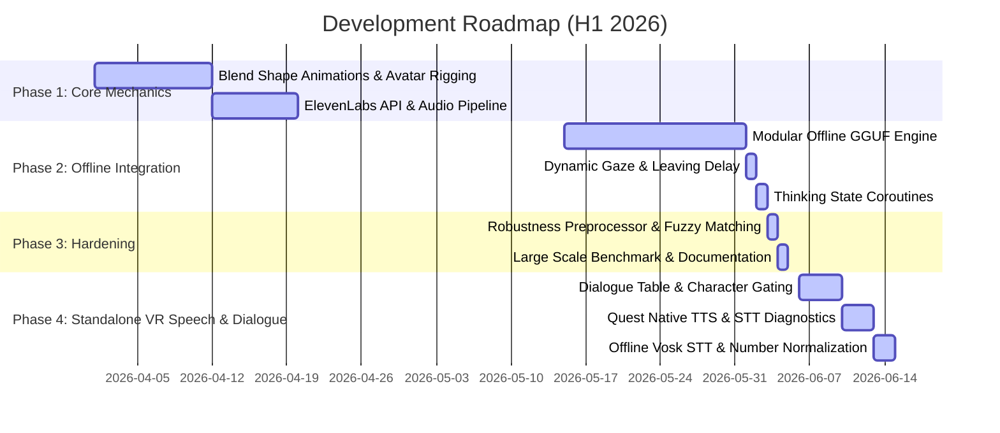

# Development Timeline: AI-Enabled Storytelling VR

This document logs the structured project milestones and development progression from inception to production deployment (April 2026 - June 2026), mapped to git commits and architectural milestones.

## 📅 Roadmap Overview

---

## 🚀 Development Phases

### Phase 1: Interactive Avatars & Speech Pipeline (April 2026)

- **April 11, 2026: Blend Shape Animations & Character Rigging**
  * *Focus*: Rigging marketplace NPC models in Unity and implementing blend shape facial expression animation loops (mouth, eyes) synchronized with raw volume inputs.
  * *Git Commit Ref*: `feat(unity/avatars): add basic blend shape mapping for speech mouth movements`
  * *Status*: COMPLETED.

- **April 18, 2026: ElevenLabs Cloud TTS & Speech Pipeline Integration**
  * *Focus*: Setting up the cloud speech pipeline, sending generated dialogue responses from Python API to ElevenLabs for natural voice synthesis, and fetching streaming audio bytes into Unity.
  * *Git Commit Ref*: `feat(tts/elevenlabs): integrate cloud audio streaming & caching`
  * *Status*: COMPLETED.

---

### Phase 2: Local AI Engines & VR Experience Polish (May - June 2026)

- **June 1, 2026: Offline GGUF LLM Engine & Piper TTS Deployment**
  * *Focus*: Replaced cloud API dependencies (ElevenLabs, OpenAI) with 100% offline, local, private, low-latency engines running on CPU/GPU CUDA. Integrated `llama-cpp-python` with `model.gguf` (Llama-3-8B) and Piper TTS ONNX models to achieve latency reduction under 1.5 seconds.
  * *Git Commit Ref*: `feat(backend/gguf): deploy offline Llama-3 and Piper TTS engines`
  * *Status*: COMPLETED.

- **June 2, 2026: Dynamic Gaze, Walking Away Delay & State Actions**
  * *Focus*: Implementing VR spatial immersion mechanics in Unity. NPCs track player head gaze, react to prolonged silence, and state-aware walkaway delays occur if the player is hostile or refuses to propose offers.
  * *Git Commit Ref*: `feat(unity/xr): integrate head gaze tracking and walkaway coroutines`
  * *Status*: COMPLETED.

- **June 3, 2026: Unity Coroutine Thinking State Animations**
  * *Focus*: Adding visual cues to indicate AI processing states. When the NPC is thinking, they display custom idle thinking animations (stroking chin, folding arms) managed by async coroutines to mask engine loading latencies.
  * *Git Commit Ref*: `feat(unity/states): add coroutine-driven thinking animation triggers`
  * *Status*: COMPLETED.

---

### Phase 3: Conversational Robustness & Hardening (June 2026)

- **June 4, 2026: Production Conversational Robustness Layer**
  * *Focus*: Created `conversation_understanding.py` preprocessing layer using fuzzy semantic matching (`rapidfuzz`) and state-aware corrections. Cleaned transcriptions of Whisper hallucinations (e.g. removing "Thanks for watching.").
  * *Git Commit Ref*: `feat(robustness): implement RapidFuzz preprocessor and Whisper post-processing`
  * *Status*: COMPLETED.

- **June 5, 2026: Large-Scale Benchmark Suite & Capstone Archive**
  * *Focus*: Programmatically generated 1,750+ inputs, simulated 100 multi-turn negotiations, scored LLM rephrasing uniqueness, verified performance constraints, and compiled the documentation archive.
  * *Git Commit Ref*: `feat(testing/benchmark): implement 1,750+ input benchmark and metrics compiler`
  * *Status*: COMPLETED.

---

### Phase 4: Standalone VR Dialogue & Quest Speech Stack (June 2026)

- **June 6-10, 2026: Level 1 Standalone Dialogue Table System**
  * *Focus*: Replaced fixed NPC reply strings in standalone VR mode with a rule-grounded dialogue table system. Added template buckets, scenario routing, placeholder replacement, character registries, greeting lines, and character-specific dialogue sets for Abdul Rahman, Francisco de Almeida, and Lakshmi Amma.
  * *Git Commit Ref*: `feat(unity/dialogue): add standalone character dialogue tables and greetings`
  * *Status*: COMPLETED.

- **June 10-13, 2026: Quest Native TTS, Dialogue-Scoped Character Selection & STT Diagnostics**
  * *Focus*: Added lightweight standalone NPC speech playback through the local audio path, implemented Android native TextToSpeech for Quest, restricted local customer generation to dialogue-registered characters, and instrumented the full Quest local STT pipeline with microphone/audio/model diagnostics.
  * *Git Commit Ref*: `feat(unity/quest): add android tts, dialogue-safe customers, and stt diagnostics`
  * *Status*: COMPLETED.

- **June 13-15, 2026: Offline Vosk STT Integration & Numeric Speech Normalization**
  * *Focus*: Integrated Vosk offline ASR for Quest as an alternative to the failing Android Whisper load path, added inspector-based STT provider selection while preserving backend and Whisper paths, copied Vosk models out of StreamingAssets for APK-safe runtime loading, and generalized spoken number normalization for bargaining phrases (e.g. "five hundred" -> `500`).
  * *Git Commit Ref*: `feat(unity/stt): integrate vosk offline quest stt and word-number normalization`
  * *Status*: COMPLETED.

- **June 15, 2026: Repository Asset Hygiene for Local Speech Runtimes**
  * *Focus*: Cleaned generated Unity/Quest build artifacts, removed oversized Whisper runtime model binaries from tracked project content, preserved placeholder/download metadata, and kept only project-required native speech runtime plugins (`libvosk.so`) and model assets.
  * *Git Commit Ref*: `chore(unity/assets): clean generated build junk and shrink runtime speech assets`
  * *Status*: COMPLETED.
